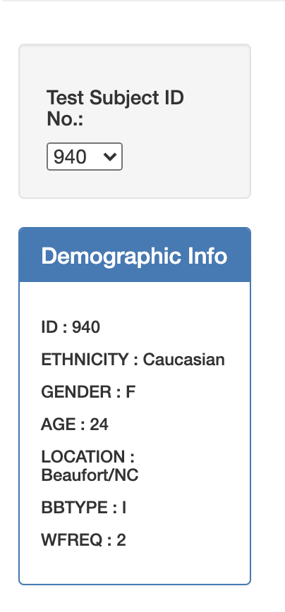

# Belly Button Biodiversity Dashboard Analysis

For this project, I built an interactive dashboard to explore the [Belly Button Biodiversity dataset](http://robdunnlab.com/projects/belly-button-biodiversity/), which catalogs the microbes that colonize human navels.

The dataset reveals that a small handful of microbial species (also called operational taxonomic units, or OTUs, in the study) were present in more than 70% of people, while the rest were relatively rare.

Languages utilized throughout this project included Javascript with D3 application and HTML. All interactive charts successfully update any time that a new sample is selected.

## Chart 1: Responsive Horizontal Bar Chart

 To initiate this project, I used the D3 library to read in `samples.json` from the provided dataset.
 I then created a horizontal bar chart with a dropdown menu to display the top 10 OTUs found in that individual sample.

* Values within the bar chart are based on `sample_values`.

* Labels for the axis representing operational taxonomic units is derived from `otu_ids`.

* When hovering over a bar, the OTU labels are displayed using the key value `otu_labels`.

## Chart 2: Responsive Bubble Chart

 Following Plotly documentation, I effectively created a bubble chart that displays each sample.

* X values within the chart are represented as `otu_ids`.

* Y values within the chart are represented as  `sample_values`.

* Sizes of the markers are determined based on `sample_values` size.

* Marker colors are coordinated by `otu_ids` under the color scheme `Portland`.

* As with the bar chart, hovering over the bubbles displays the appropriate OTU label based on `otu_labels` in the code.

## Visual 3 - Responsive Demographic Information Display
 To provide a quick glance at sample metadata involvind an individual's demographic information, I effectively referenced each key-value pair from the metadatat JSON object to responsively display the following:

 * Sample ID

 * Ethnicity

 * Gender

 * Age

 * Location (City/State)

 * Belly Button Type (Inner/Outer)

 * Washing Frequency (WFREQ)

 

## Visual 4 - Responsive Gauge Chart

Following the documentation for creating a Gauge Chart (<https://plot.ly/javascript/gauge-charts/>), I created a responsive gauge chart which plots and scales the weekly washing frequency of the individual. This gauge operates on a scale of 0-9 with individually identified tick marks.

## Deployment

This work is effectively represented on both my personal repository as well as deployed through GitHub Pages.

- - -

## References

Hulcr, J. et al.(2012) _A Jungle in There: Bacteria in Belly Buttons are Highly Diverse, but Predictable_. Retrieved from: [http://robdunnlab.com/projects/belly-button-biodiversity/results-and-data/](http://robdunnlab.com/projects/belly-button-biodiversity/results-and-data/)

- - -

© 2021 Trilogy Education Services, LLC, a 2U, Inc. brand. Confidential and Proprietary. All Rights Reserved.
